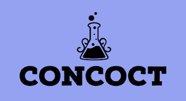

<p align="center">
  
</p>

<div align="center">
 <a href="https://crates.io/crates/concoct">
    
  </a>
  <a href="https://docs.rs/concoct">
    
  </a>
   <a href="https://github.com/concoct-rs/concoct/actions">
    
  </a>
</div>

<div align="center">
 <a href="https://github.com/concoct-rs/concoct/tree/main/examples">Examples</a>
</div>

## Rust zero-cost reactive UI framework.

```rust
enum Event {
    Increment,
    Decrement,
}

fn counter(count: &i32) -> impl View<Web<Event>> {
    (
        Html::h1((), count.to_string()),
        Html::button(on("click", |_| Event::Increment), "More"),
        Html::button(on("click", |_| Event::Decrement), "Less"),
    )
}

fn main() {
    concoct::web::run(
        0,
        |count, event| match event {
            Event::Increment => *count += 1,
            Event::Decrement => *count -= 1,
        },
        counter,
    );
}
```

## Features
 - Cross-platform components
 - Compile-time UI tree
 - Efficient view updates
 - Inspired by the elm architecture


